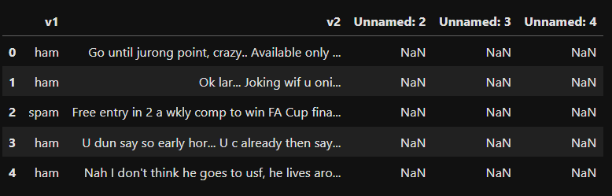
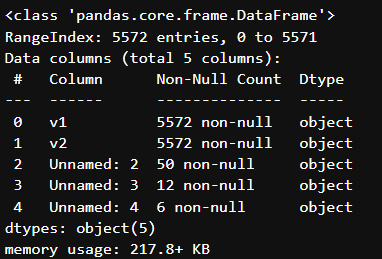
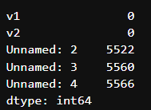
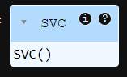
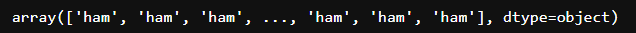
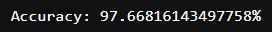

# Implementation-of-SVM-For-Spam-Mail-Detection

## AIM:
To write a program to implement the SVM For Spam Mail Detection.

## Equipments Required:
1. Hardware – PCs
2. Anaconda – Python 3.7 Installation / Jupyter notebook

## Algorithm
1. Load the spam dataset and handle encoding properly.
2. Display basic information and check for null values.
3. Extract the message text as features (x) and labels (y) for classification.
4. Split the dataset into training and testing sets.
5. Convert the text data into numerical vectors using CountVectorizer.
6. Train an SVM classifier on the transformed training data.
7. Predict on test data and evaluate model accuracy using accuracy_score.

## Program:
```
/*
Program to implement the SVM For Spam Mail Detection..
Developed by: Nanda Kishor S P
RegisterNumber: 212224040210
*/
```

```python
# importing the necessary libraries
import pandas as pd
from sklearn import metrics
from sklearn.model_selection import train_test_split
from sklearn.feature_extraction.text import CountVectorizer
from sklearn.svm import SVC
```

```python
# loading the spam dataset with appropriate encoding
data = pd.read_csv("spam.csv", encoding="Windows-1252")
```

```python
# displaying the head values of the dataframe
data.head()
```

```python
# displaying dataframe information
data.info()
```

```python
# checking for null values in the dataset
data.isnull().sum()
```

```python
# separating the features and labels
x = data["v2"].values  # text messages
y = data["v1"].values  # labels: spam or ham
```

```python
# splitting data into training and testing sets
x_train, x_test, y_train, y_test = train_test_split(x, y, test_size=0.2, random_state=0)
```

```python
# converting text data to numerical feature vectors
cv = CountVectorizer()
x_train = cv.fit_transform(x_train)
x_test = cv.transform(x_test)
```

```python
# training the Support Vector Machine model
svc = SVC()
svc.fit(x_train, y_train)
```

```python
# predicting the labels for test data
y_pred = svc.predict(x_test)
y_pred
```

```python
# calculating and displaying the accuracy of the model
accuracy = metrics.accuracy_score(y_test, y_pred)
print(f"Accuracy: {accuracy*100}%")
```

## Output:

### DataFrame Head Values
  

### DataFrame Info
  

### Null Value Count
  

### Training the Model
  

### Predicting the test data
  

### Accuracy Score
  

## Result:
Thus the program to implement the SVM For Spam Mail Detection is written and verified using python programming.
